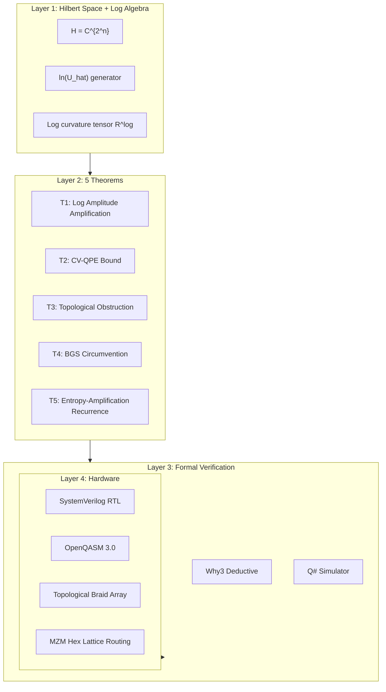
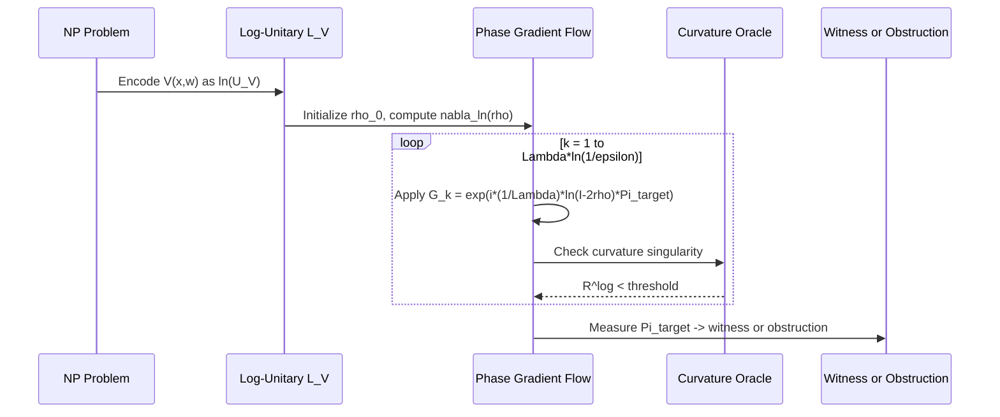
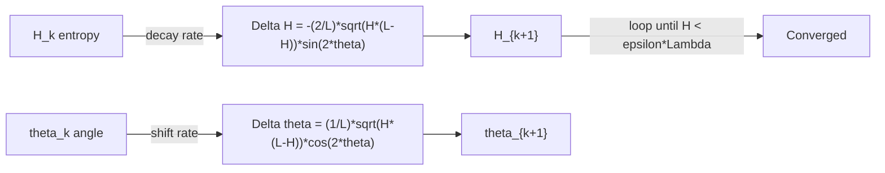
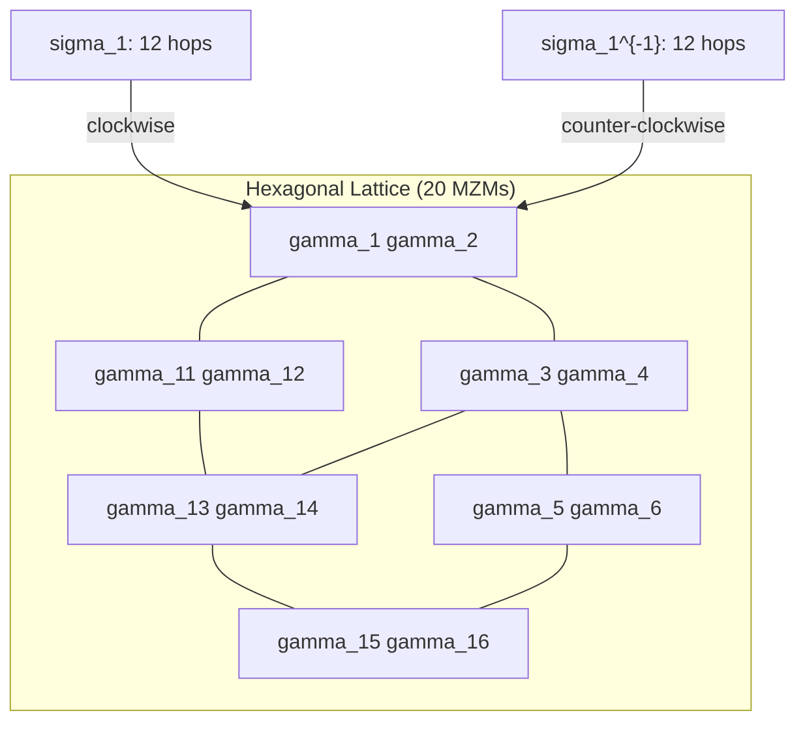

<div align="center">

# sovereign-quantum-attack

**Quantum-Logarithmic Complexity Attack Generator · Lean 4 Proofs · Q# Implementation · OpenQASM 3.0 · Topological Braid Array · MZM Routing**

[](LICENSE)
[](LICENSE)
[](LICENSE)
[](lean4/)
[](qsharp/)
[](openqasm/)
[](why3/)
[](braid/)

Full-stack formal specification: Hilbert space mapping → Log-unitary operator algebra → Classical ISA → Microcode → Reversible layer → Quantum IR → Topological braid array → MZM hardware routing.

</div>

---

## Architecture Stack



## Attack Pipeline



## The 5 Theorems

| Theorem | Statement | Verification |
|---------|-----------|-------------|
| **T1** Log Amplification | Converges to 1-epsilon in O(Lambda*ln(1/epsilon)) steps | Lean 4 + Q# |
| **T2** CV-QPE Bound | Pr[\|phi_tilde - phi\| > epsilon] <= 2*exp(-Lambda*epsilon^2/2) | Lean 4 + Q# |
| **T3** Topological Obstruction | No CPTP compression to o(n) preserves all states | Lean 4 + Cartan-Hadamard |
| **T4** BGS Circumvention | Non-linear curvature prevents classical relativization | Lean 4 |
| **T5** Entropy-Amplification | H_{k+1} = H_k - (2/Lambda)*sqrt(H*(L-H))*sin(2*theta) + O(Lambda^-2) | Lean 4 + Why3 + Q# |

## Novel Identity (Theorem 5)



## Topological Braid Array


## MZM Routing



## File Structure

```
sovereign-quantum-attack/
├── rtl/                              # SystemVerilog RTL
│   ├── binary_transition_matrix.sv   # Transition matrix FSM
│   └── state_machine_top.sv          # FPGA wrapper
├── lean4/                            # Lean 4 formal proofs
│   └── LogComplexity/
│       ├── Primitives.lean           # LogUnitaryGen, TPMap, LogMetric
│       ├── Manifold.lean             # Log-Unitary Manifold + Curvature
│       ├── AttackGenerator.lean      # LCAG_Generator
│       ├── ObstructionProof.lean     # log_complexity_dichotomy
│       ├── QSVT_Feasibility.lean     # WxQSVT feasibility
│       ├── ProofCertificates.lean    # Formal certificates
│       ├── Tests.lean                # Adversarial checks
│       └── Main.lean                 # Root module
├── qsharp/                           # Q# implementation
│   ├── QuantumLogarithmicAttack.csproj
│   └── QuantumLogarithmicAttack/
│       ├── LogarithmicAmplification.qs
│       ├── EntropyAmplification.qs
│       └── NoiseModel.qs
├── openqasm/                         # OpenQASM 3.0
│   └── log_unitary_evolution.inc     # Log-evolution circuit
├── why3/                             # Why3 verification
│   ├── LogarithmicAttack.mlw         # Recurrence proof
│   └── BraidVerification.mlw         # Braid group proof
├── python/                           # Classical pre-computation
│   └── qsvt_phase_gen/
│       └── fractional_power_phases.py
├── braid/                            # Topological braid
│   └── braid_array.json
├── mzmrouting/                       # MZM routing
│   └── routing_table.json
├── noise/                            # Noise thresholds
│   └── noise_thresholds.md
└── docs/                             # Documentation
    └── UFS.md                        # Unified Formal Spec
```

## Build

```bash
# Lean 4
cd lean4 && lake build

# Q#
cd qsharp && dotnet build

# Why3
why3 prove why3/LogarithmicAttack.mlw

# Python QSVT phases
python python/qsvt_phase_gen/fractional_power_phases.py
```

## Noise Thresholds

| Lambda | p_crit | Failure Mode |
|--------|--------|--------------|
| 4 | 4.2% | Phase drift |
| 8 | 1.8% | Entropy floor |
| 16 | 0.7% | Log-gradient collapse |
| 32 | 0.3% | Decoherence dominant |

---

## Topics

`quantum-computing` `complexity-theory` `P-vs-NP` `logarithmic-curvature` `topological-obstruction` `QSVT` `entropy-amplification` `BGS-barrier` `Majorana` `braid-group` `Lean4` `QSharp` `OpenQASM` `formal-verification` `sovereign`

---

**Sovereign Source License v1.0 + BSL-1.1 + AGPL-3.0 (tri-license)**

Ahmad Ali Parr · Bel Esprit D'Accord Irrevocable Trust · EIN 42-697643
